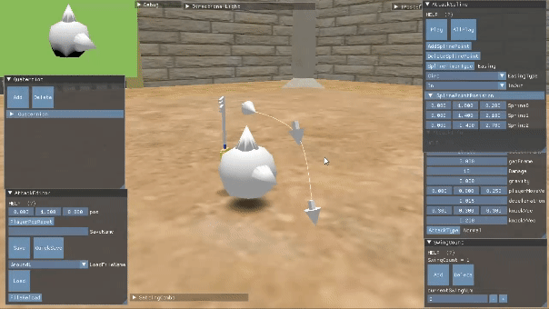
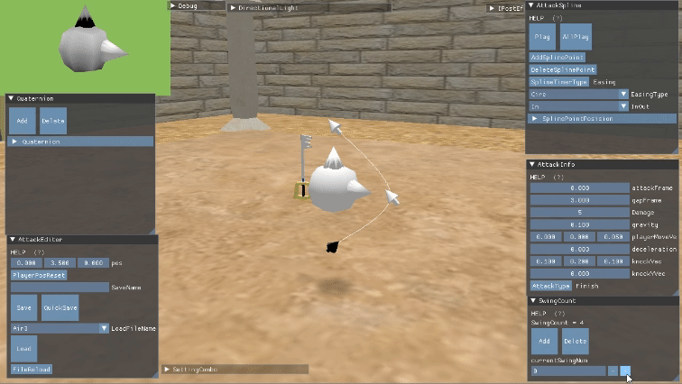
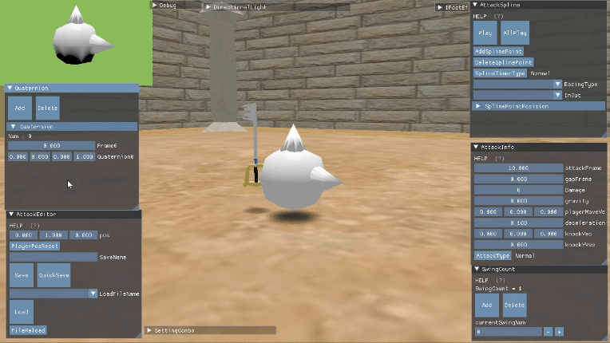

# REngine
### DirectX 12を使用したゲームエンジン
* 使用している外部ライブラリ
    * Imgui
    * DirectXTex
    * assimp

# 作品紹介
この作品は攻撃やガードの際に適切にキャラを動かすことでプレイヤーの感じるストレスを無くすことをテーマに制作している個人制作作品です。  
* 地上攻撃

* 空中攻撃

この攻撃を制作するためにエディターを制作しています。  
## エディター
エディターでは、攻撃に関することを編集し出力・読み込みができます。
* 攻撃の軌道編集

* 多段ヒット

* 姿勢制御・プレビュー表示
